# Credit Default & Expected-Loss Modelling with NLP-Augmented Features

**Zhankai Zhang · Weiyu Wang**  ·  BU MF810 Advanced Programming — Final Project


A distributed credit-risk pipeline that estimates per-loan **Expected Loss**

```
EL = PD × LGD × EAD
```

on the full Lending Club book (~2.26M loans, 151 columns, 2007–2018Q4), and then asks one
question seriously: **does unstructured text add anything a well-built WoE scorecard does not
already capture?**

The answer, measured rather than asserted, is **almost nothing** — and the way that null is
established is the point of the project. A two-phase design separates genuine text signal from
missing-data artefacts, six PD variants are built incrementally so each feature block can be
priced on its own, and the one variant that bundles every NLP feature together turns out to be
the *worst* of the six and to **raise** projected expected loss.

---

## How it works

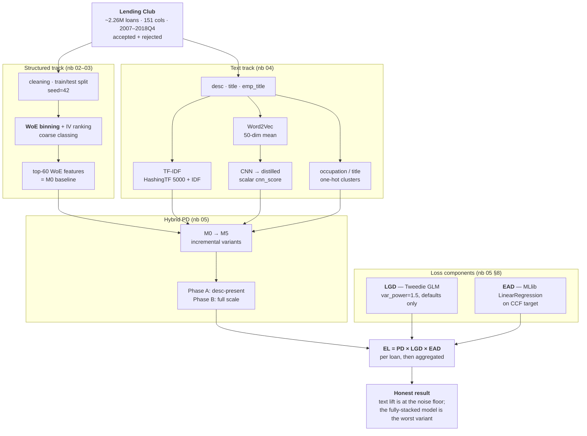
```mermaid
flowchart TD
  R["<b>Lending Club</b><br/>~2.26M loans · 151 cols · 2007–2018Q4<br/>accepted + rejected"]

  subgraph P ["Structured track (nb 02–03)"]
    P1["cleaning · train/test split<br/>seed=42"] --> P2["<b>WoE binning</b> + IV ranking<br/>coarse classing"]
    P2 --> P3["top-60 WoE features<br/>= M0 baseline"]
  end

  subgraph N ["Text track (nb 04)"]
    N1["desc · title · emp_title"] --> N2["TF-IDF<br/>HashingTF 5000 + IDF"]
    N1 --> N3["Word2Vec<br/>50-dim mean"]
    N3 --> N4["CNN → distilled<br/>scalar cnn_score"]
    N1 --> N5["occupation / title<br/>one-hot clusters"]
  end

  subgraph M ["Hybrid PD (nb 05)"]
    M1["M0 → M5<br/>incremental variants"] --> M2["Phase A: desc-present<br/>Phase B: full scale"]
  end

  subgraph L ["Loss components (nb 05 §8)"]
    L1["<b>LGD</b> — Tweedie GLM<br/>var_power=1.5, defaults only"]
    L2["<b>EAD</b> — MLlib LinearRegression<br/>on CCF target"]
  end

  R --> P1
  R --> N1
  P3 --> M1
  N2 --> M1
  N4 --> M1
  N5 --> M1
  M2 --> E["<b>EL = PD × LGD × EAD</b><br/>per loan, then aggregated"]
  L1 --> E
  L2 --> E
  E --> V["<b>Honest result</b><br/>text lift is at the noise floor;<br/>the fully-stacked model is the worst variant"]
```

---

## Why two phases

The free-text `desc` field is **missing in ~94%** of loans — Lending Club stopped collecting it
after 2014. Training text features on the full book would dilute whatever signal exists into
zero-fill noise, and any measured "lift" would mostly be the model learning *whether the field
exists* rather than what it says.

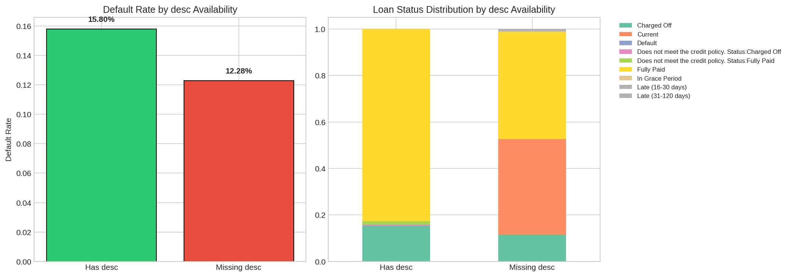

So the PD model is run as **two independent experiments**:

| Phase | Subset | Test loans | Variants | What it answers |
|---|---|---|---|---|
| **A** | `desc_missing == 0`, re-split 80/20 | **5,018** | 6 (M0 → M5) | Is there real signal in the text, where the text exists? |
| **B** | original split, full book | **452,931** | 2 (baseline + categorical) | What survives at production scale? |

Phase B deliberately drops tfidf / w2v / cnn — they are zero-filled for 94% of rows there — and
keeps only the always-present categorical text signals (`title`, `emp_title`).

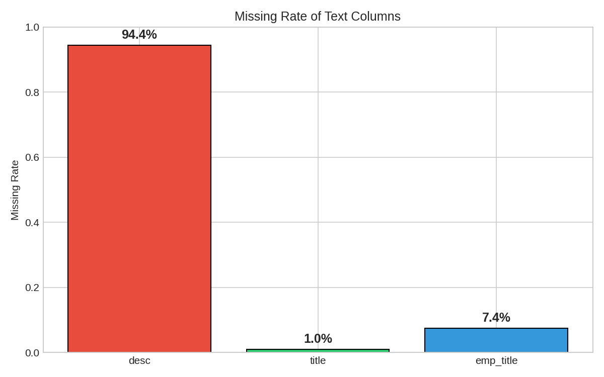

---

## Results

All numbers below are regenerated by `notebooks/05_hybrid_pd_model.ipynb` and persisted in
`outputs/tables/hybrid_model_comparison_{subset,full}.csv`. Metrics are AUC, Gini = 2·AUC − 1,
and KS = max(TPR − FPR), all computed on held-out test loans (`src/evaluation.py`).

### Phase A — desc-present subset (5,018 test loans)

| Variant | Features | AUC | Gini | KS | Δ AUC vs M0 |
|---|---|---|---|---|---|
| M0_baseline | 60 | 0.6830 | 0.3660 | 0.2662 | — |
| M1_+tfidf | 61 | 0.6748 | 0.3496 | 0.2754 | **−0.0082** |
| **M2_+w2v** | 61 | **0.6881** | **0.3761** | **0.2912** | **+0.0051** |
| M3_+cnn | 61 | 0.6862 | 0.3723 | 0.2834 | +0.0031 |
| M4_+categorical | 62 | 0.6806 | 0.3611 | 0.2677 | −0.0024 |
| M5_full | 65 | 0.6760 | 0.3520 | 0.2724 | **−0.0070** |

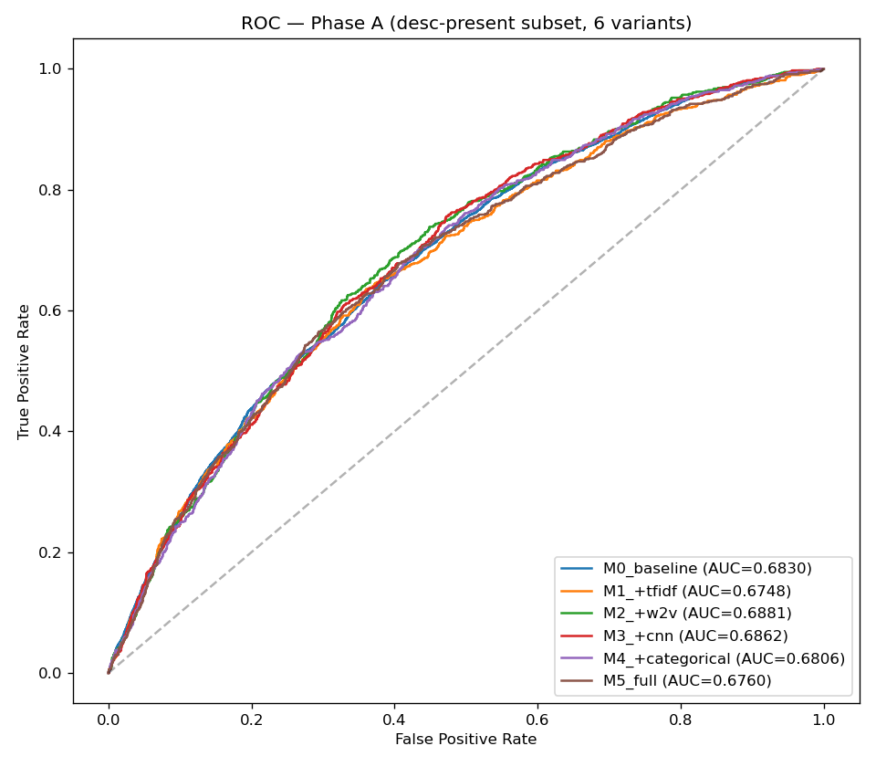
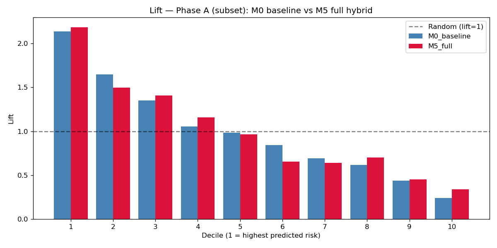

### Phase B — full book (452,931 test loans)

| Variant | Features | AUC | Gini | KS | Δ AUC vs M0 |
|---|---|---|---|---|---|
| M0_baseline_full | 60 | 0.7415 | 0.4831 | 0.3548 | — |
| M_categorical_full | 62 | **0.7428** | **0.4856** | **0.3576** | **+0.0013** |

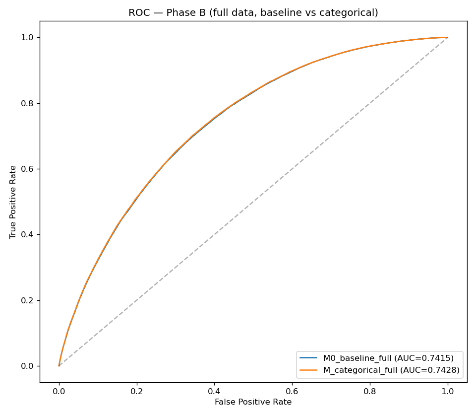
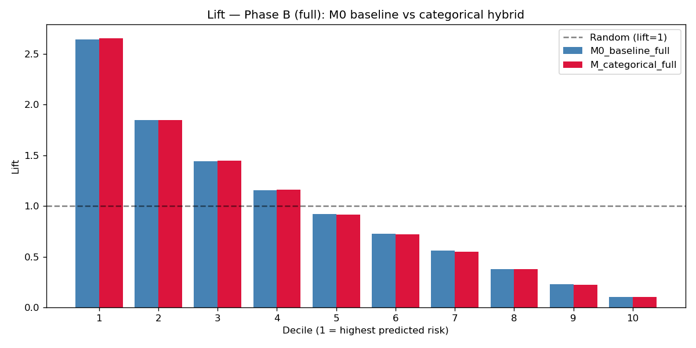

### How to read these tables

- **Word2Vec is the only text block that pays, and it pays little.** M2 is the best variant in
  Phase A at **+0.0051 AUC / +2.5pp KS**. On 5,018 test loans that is at or just above the noise
  floor — directionally consistent, not economically decisive.
- **TF-IDF *costs* 0.0082 AUC on this fold.** A 5000-dim hashed sparse block fed into a logistic
  regression with ~25K training rows is a capacity problem, not an information one: the block
  overfits rare tokens. KS still improves (+0.9pp), which is the signature of a model that ranks
  the extreme tail slightly better while degrading the middle.
- **The fully-stacked model is the worst of the six.** M5_full (−0.0070) sits below M0, below M2,
  and below M3. Concatenating TF-IDF, Word2Vec, the CNN score *and* the categorical one-hots into
  one linear model introduces collinearity the LR cannot disentangle — the CNN score is distilled
  *from* the Word2Vec mean, so M3 and M2 are largely the same information twice. **More features
  made the model worse, and the experiment was designed so that this is measurable.**
- **Scale moves the baseline far more than text ever does.** M0 goes from 0.6830 (Phase A) to
  0.7415 (Phase B) — **+0.0585 AUC from 72× more training rows**, roughly 11× the best text lift.
  The highest-value intervention here is data volume, not feature cleverness.
- **The always-present categoricals are the one text signal that survives production scale**
  (+0.0013 AUC, +0.3pp KS on 452,931 loans) — small, but measured on a sample where it is real.

### What the models actually weight

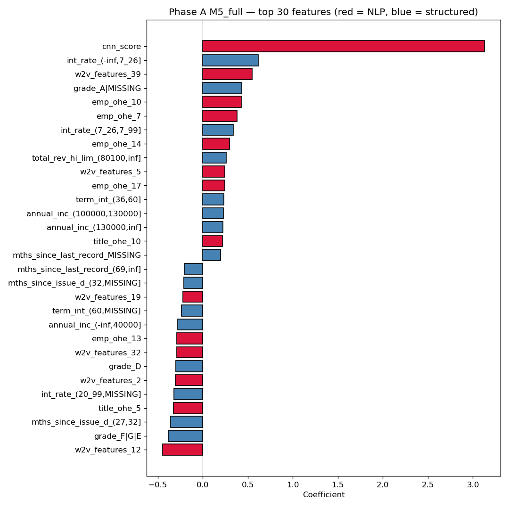
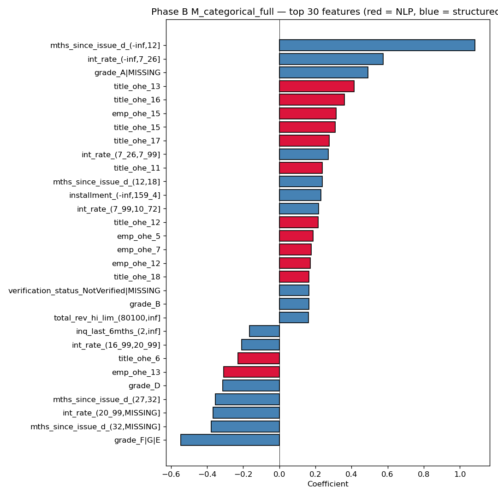

### The text signal on its own

Before any hybridisation, each NLP stage was scored standalone on the desc-present subset
(`outputs/tables/nlp_stage_metrics.json`):

| Stage | AUC | Gini |
|---|---|---|
| TF-IDF → LR | 0.5830 | 0.1661 |
| Word2Vec → LR | 0.5752 | 0.1503 |
| TF-IDF + Word2Vec combined | 0.5845 | 0.1690 |
| Word2Vec → **CNN** | **0.5870** | **0.1740** |
| sentence-extraction variants (match3 / match2 / dist2) | 0.5709 / 0.5720 / 0.5670 | 0.1417 / 0.1441 / 0.1340 |

**Text alone discriminates barely above chance (0.567–0.587).** The CNN is the best text-only
model, and the three sentence-extraction heuristics all underperform plain bag-of-words — which
is why none of them entered the hybrid stack. Set against a 0.6830 structured baseline, these
numbers predict the hybrid outcome before the hybrid is built.

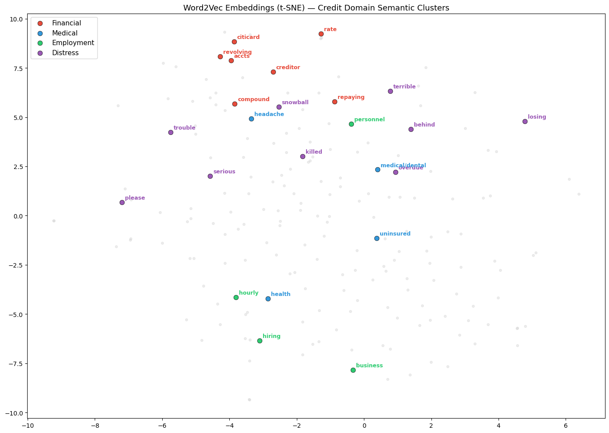
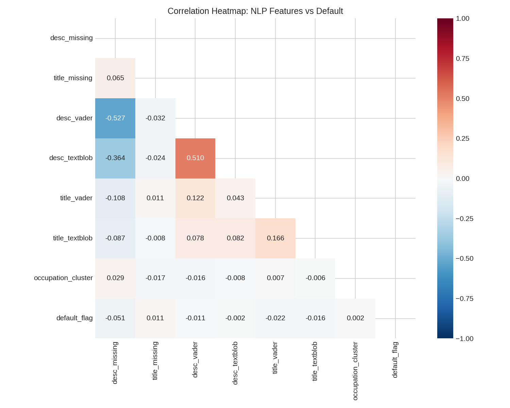

Descriptive text analysis that motivated the feature choices:

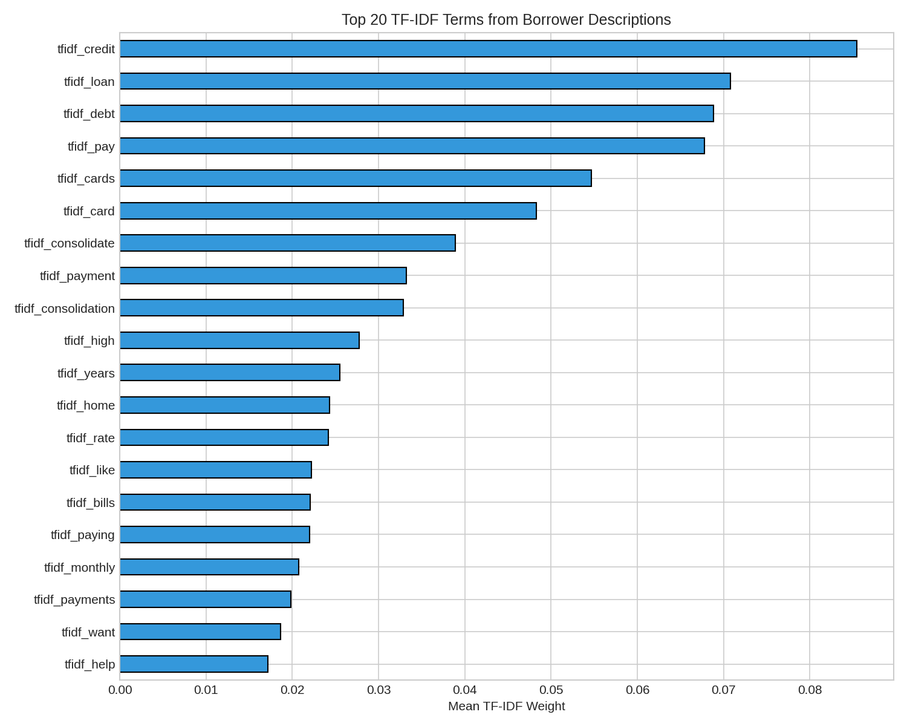
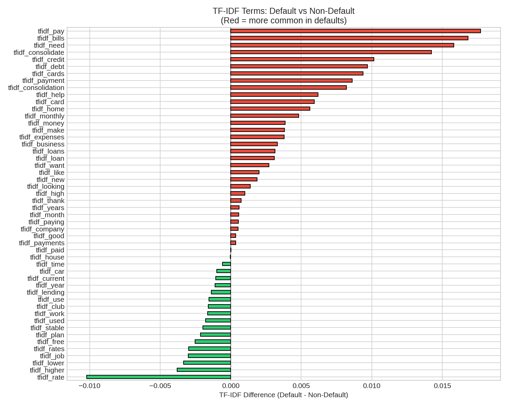

### Occupation clustering — 411,809 job titles into 20 categories

`emp_title` is free text with **512,693 distinct values** across the 2.26M-loan book — **411,809**
after lowercasing and trimming — and is missing for only 7.4% of loans. That cardinality cannot be
one-hot encoded, so the field is reduced through an unsupervised pipeline that turns free text into
20 model-ready categories:

```
lower(trim(emp_title))  ->  RegexTokenizer  ->  StopWordsRemover
                        ->  HashingTF(1000) ->  IDF
                        ->  KMeans(k=20, seed=42)  ->  OneHotEncoder
```

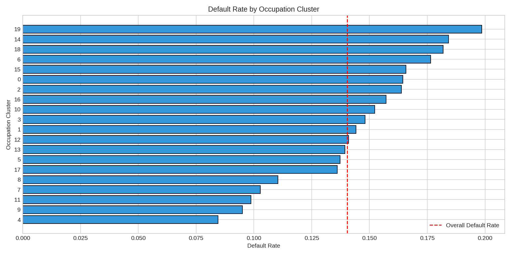

Default rates spread from **~9% (C8) to ~15.5% (C11)** against a **12.86%** book average. That ~6.5pp
spread clears the ~5pp rule of thumb used to judge whether a categorical carries usable signal, which
is why `emp_cluster` entered the PD model — and its measured incremental contribution was **+0.0013
AUC**. The two facts are not in tension: **univariate separation and incremental lift are different
questions**, and occupational information is already partly encoded in income, employment length and
grade.

**The honest caveat.** Cluster C0 absorbs **1,342,072 rows (74.2%)**, leaving 465,698 spread across
the other 19 — which do form clean semantic groups (sales/management, technical, healthcare/education,
skilled trades, public sector). C0 is **not** mainly a missing-value artefact: `emp_title` is missing
for only 7.4% of loans, which accounts for at most 7 of those 74 points. The real cause is that job
titles are one-to-three-word strings, so hashing them into 1,000 dimensions leaves vectors too sparse
for Euclidean K-means to separate. Replacing hashed TF-IDF with Word2Vec or sentence embeddings, or
mapping onto a standard occupation taxonomy, is the right next attempt.

The `title` field (borrower-stated loan purpose, ~99.5% present) needed no clustering — its top 20
normalised values already cover ~95% of loans, so it is bucketed top-20-plus-`other` and one-hot encoded:

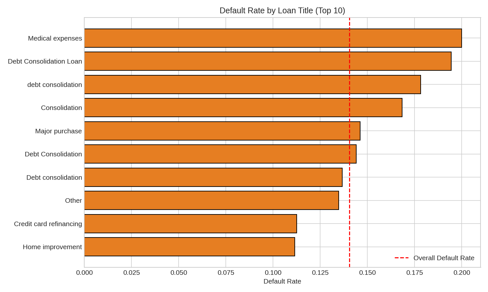

---

## Expected Loss

PD comes from the variants above; **LGD** is a Tweedie GLM (`var_power=1.5`, `statsmodels` —
MLlib has no Tweedie/Beta GLM) fit on defaulted loans only; **EAD** is an MLlib
`LinearRegression` on a credit-conversion-factor target (`CCF = total_rec_prncp / funded_amnt`).
Both are fit once on the full training set and joined back per phase.

| | Loans | Mean LGD | Mean EAD | Total EL — baseline | Total EL — hybrid | Δ per loan |
|---|---|---|---|---|---|---|
| Phase A (M0 vs **M5_full**) | 5,018 | 0.603 | $12,160 | $6,041,708 | $6,091,645 | **+$9.95** |
| Phase B (M0 vs M_categorical) | 452,931 | 0.700 | $9,667 | $428,704,435 | $428,671,886 | **−$0.07** |

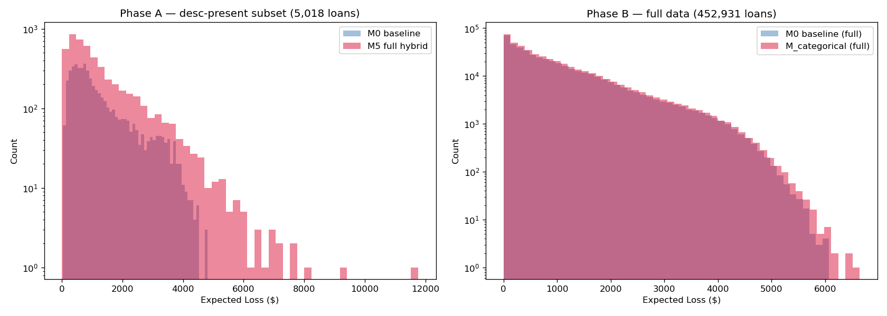

**Phase A's hybrid raises projected loss by ~$50K, and that is the expected consequence, not an
anomaly.** The EL comparison uses **M5_full** as the hybrid — chosen as the "showcase" because it
bundles every NLP signal — and M5_full is precisely the variant that ranks *worst* on AUC. A
weaker ranking model redistributes PD mass, and here it redistributes it upward. Had M2_+w2v
(the actual best variant) been carried into the EL stage, the comparison would be the one worth
reporting; as run, the EL table is a faithful reflection of a feature-stacking decision that the
discrimination metrics had already rejected.

Phase B's −$0.07 per loan over 452,931 loans is a −$32.5K reduction on a $429M book — a 0.008%
effect. Directionally favourable, economically immaterial.

### Calibration check

Mean predicted PD against the realised default rate on the same test loans:

| | Mean PD (baseline) | Mean PD (hybrid) | Realised default rate |
|---|---|---|---|
| Phase A | 0.1565 | 0.1573 | **0.1586** |
| Phase B | 0.1288 | 0.1288 | **0.1297** |

Both models are well calibrated in aggregate (within 0.2pp and 0.1pp respectively). **Calibration
and discrimination are separate properties**, and this is the clean illustration: the models agree
almost exactly on *how much* default there is while differing on *which loans* carry it.

---

## Honest limitations

- **Phase A is a 5,018-loan test fold.** Differences of ±0.005 AUC are within sampling error; no
  variant ranking in Phase A should be treated as established. The two findings that survive are
  the *sign pattern* (stacking hurts) and the baseline's scale sensitivity.
- **No multiple-comparison correction.** Six Phase A variants were compared on one fold; the best
  of six is biased upward by selection. The reported +0.0051 is an upper bound.
- **One linear model class throughout.** PD is logistic regression (MLlib) in every variant. The
  collinearity that sinks M5_full is a property of the *learner*, so "NLP features do not help" is
  properly stated as "NLP features do not help a linear PD model here". A GBM or per-block
  regularisation is the obvious next test and was not run.
- **Single split, no cross-validation.** `seed=42`, one 80/20 split per phase. Deterministic and
  reproducible, but it gives no variance estimate.
- **The CNN is distilled to one scalar** so it can re-enter an MLlib `VectorAssembler`. That makes
  it pipeline-compatible and nearly redundant with the Word2Vec mean it was trained on — a design
  compromise, visible in M3 ≈ M2.
- **EL is a point estimate.** No confidence interval, no macro/vintage stress, no through-the-cycle
  adjustment. LGD is fit on defaulted loans only and applied to all, which is standard but
  optimistic at the tails.
- **Lending Club is originated, self-reported data** from one platform and one era. Neither the
  scorecard nor the text findings should be assumed to transfer to bank-originated portfolios.

---

## Reproducing this

The whole pipeline runs inside a Docker image shipping PySpark + Jupyter Lab + all dependencies.

**1. Place raw data** under `data/raw/` (gitignored):

```
data/raw/accepted_2007_to_2018Q4.csv.gz
data/raw/rejected_2007_to_2018Q4.csv.gz
```

**2. Build and launch** — first build takes 10–20 min (TensorFlow ~600MB, PySpark, NLTK corpora);
later launches are cached:

```bash
docker-compose up
```

Open the `http://127.0.0.1:8888/lab?token=...` URL printed in the terminal.

**3. Run the notebooks in order:**

| Notebook | Does |
|---|---|
| `00_file_convert` | decompress `.csv.gz` → `.csv` |
| `01_data_loading` | CSV → Parquet, train/test split (`seed=42`) |
| `02_general_prep` | cleaning + EDA |
| `03_feature_engineering` | WoE binning, coarse classing, IV-based selection |
| `04_nlp_pipeline_dev` | TF-IDF, Word2Vec, CNN distillation, occupation clusters |
| `05_hybrid_pd_model` | PD variants M0–M5, LGD, EAD, Expected Loss, all tables and figures |

End-to-end non-interactively:

```bash
docker exec mf810-project jupyter nbconvert --to notebook \
    --execute notebooks/05_hybrid_pd_model.ipynb --inplace
```

### Reproducibility checklist

- [x] Docker-pinned Python and Spark versions
- [x] Raw → final runnable from `docker-compose up`
- [x] Deterministic train/test split (`seed=42`)
- [x] Schema-alignment assertion guards notebook 05 against upstream drift
- [x] Every reported metric persisted under `outputs/tables/`
- [x] Two showcase models persisted: `outputs/models/hybrid_pd_M5_subset/` (Phase A) and
      `outputs/models/hybrid_pd_categorical_full/` (Phase B)

---

## Repository layout

```
.
├── docker-compose.yml · Dockerfile · requirements.txt   reproducible environment
├── data/
│   ├── raw/           Lending Club CSVs (gitignored)
│   └── parquet/       intermediate Parquet (gitignored)
├── notebooks/         00 → 05, run in order
├── src/
│   ├── spark_utils.py              SparkSession factory
│   ├── general_prep.py             train/test split + cleanup
│   ├── pd_feature_engineering.py   WoE/IV tables, binning, coarse classing
│   └── evaluation.py               AUC · Gini · KS · lift · plots
├── outputs/
│   ├── figures/       all PNGs referenced above
│   ├── tables/        model comparisons, EL per loan, WoE reports
│   └── models/        saved MLlib pipelines + cnn_model.h5
└── docs/              proposal, grading rubric, reference paper
```

## Tech stack

| Layer | Used |
|---|---|
| Distributed compute | **PySpark + MLlib** — WoE engineering, LogisticRegression, LinearRegression, `VectorAssembler`, `Pipeline` |
| Deep learning | **TensorFlow / Keras** — CNN over Word2Vec embeddings, distilled to a scalar |
| Statistics | **statsmodels** — Tweedie GLM for LGD (no Spark equivalent) |
| NLP | **NLTK · VADER · TextBlob** — cleaning, tokenisation, sentiment baselines |
| Visualisation | **matplotlib · seaborn** |
| Environment | **Docker Compose** — pinned, one-command |

---

*Course project for BU MF810 Advanced Programming. All metrics in this README are regenerated by
`notebooks/05_hybrid_pd_model.ipynb` and stored under `outputs/tables/`; no number here is quoted
from an earlier run.*
